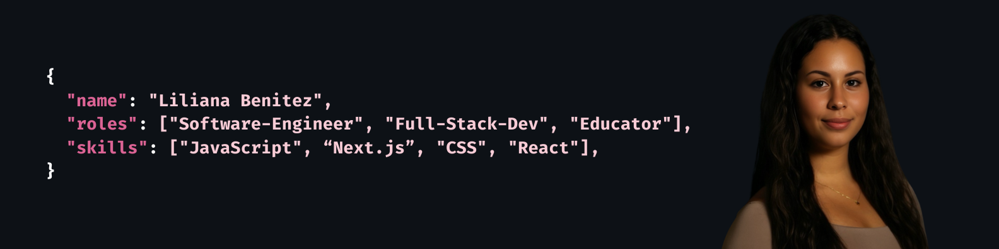

# Hi there, I'm Lili

I’m a software engineer, full-stack developer, educator, and the founder of [**Tech Babes**](https://techbabes.dev/), a playful brand celebrating women in tech with cute, empowering merch.
I’m passionate about building beautiful, maintainable code and empowering others to do the same.  
I specialize in **React, TypeScript, Next.js, PostgreSQL**, and love exploring creative, interactive side projects that mix code + fun.  
When I’m not coding, you can find me mentoring new developers, designing techy merch, designing fun apps for friends & family.

##  What I Do
- **Software Engineer at [arol.dev](https://arol.dev):** designing and building educational tools, including a custom LMS, to make learning easier for students and mentors.
- **Educator & Mentor:** teaching full-stack development, algorithms, and system design to aspiring software engineers.
- **Founder of Tech Babes:** blending code, creativity, and community.

##  Tech & Tools I Love

 

 

##  What I’m Currently Working On
- Developing a **custom site for Tech Babes** with unique, interactive features (more than just an ordinary online shop) 
- Adding **data persistence and backend functionality** to my side projects  
- Exploring **creative uses of APIs and playful UI/UX** to make everyday activities more fun  
- Preparing to take a **UI/UX design course** to deepen my design skills and learn Figma 

##  Let’s Connect
- lilyybenitezz@gmail.com  
- [LinkedIn](https://www.linkedin.com/in/lili-benitez/)  
- [Tech Babes Shop](https://techbabes.dev/)  

<!--
**liliana-benitez/liliana-benitez** is a ✨ _special_ ✨ repository because its `README.md` (this file) appears on your GitHub profile.

Here are some ideas to get you started:

- 🔭 I’m currently working on ...
- 🌱 I’m currently learning ...
- 👯 I’m looking to collaborate on ...
- 🤔 I’m looking for help with ...
- 💬 Ask me about ...
- 📫 How to reach me: ...
- 😄 Pronouns: ...
- ⚡ Fun fact: ...
-->
